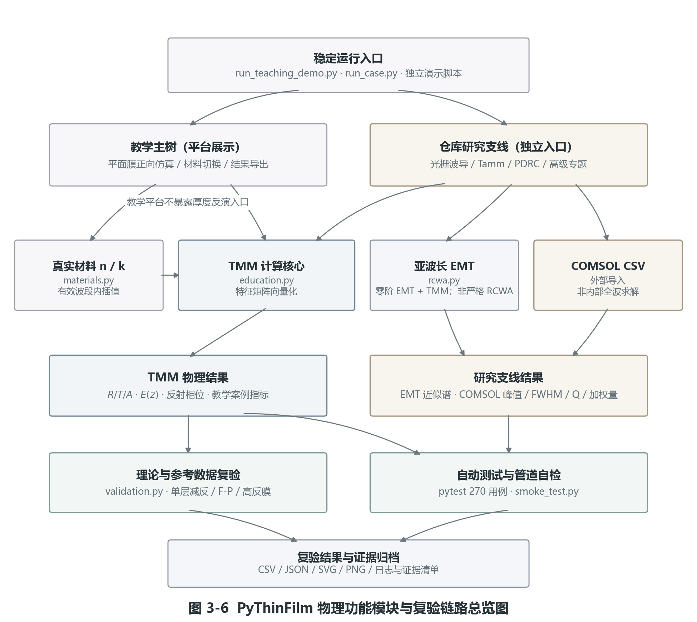
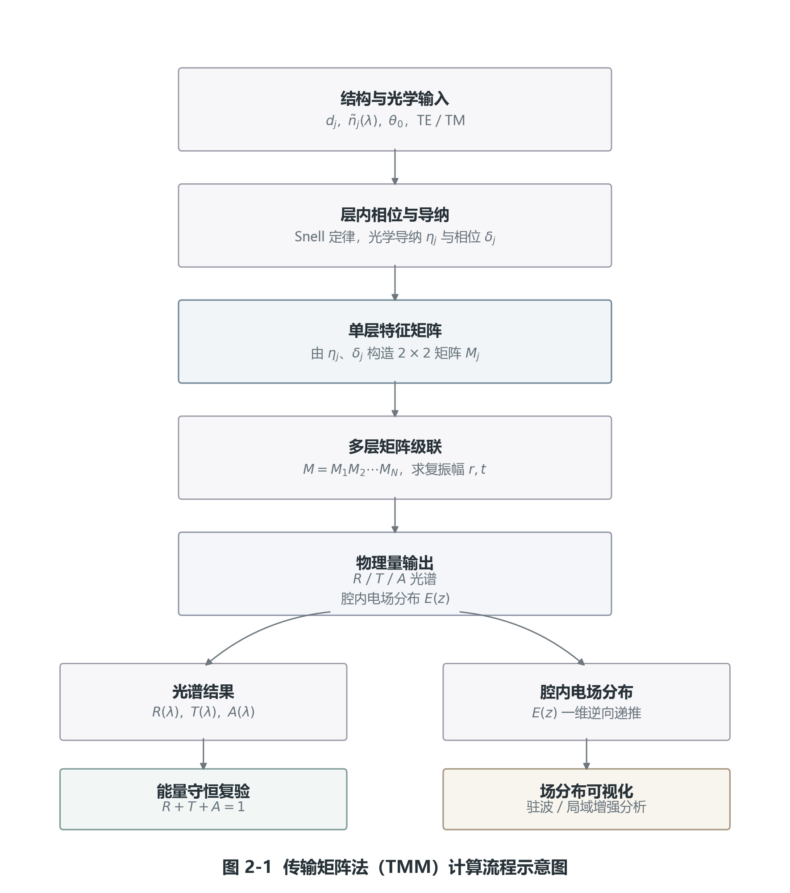
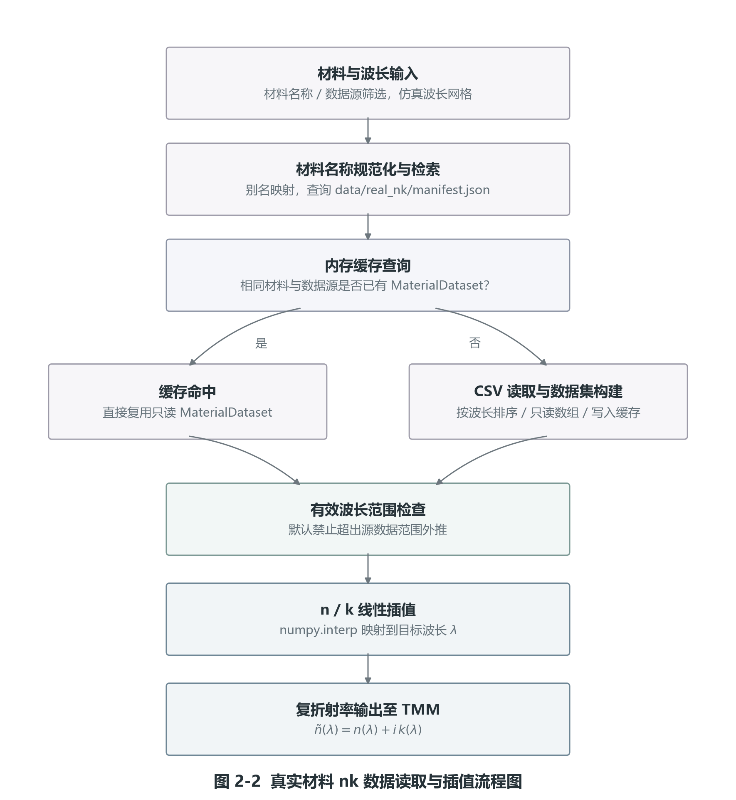
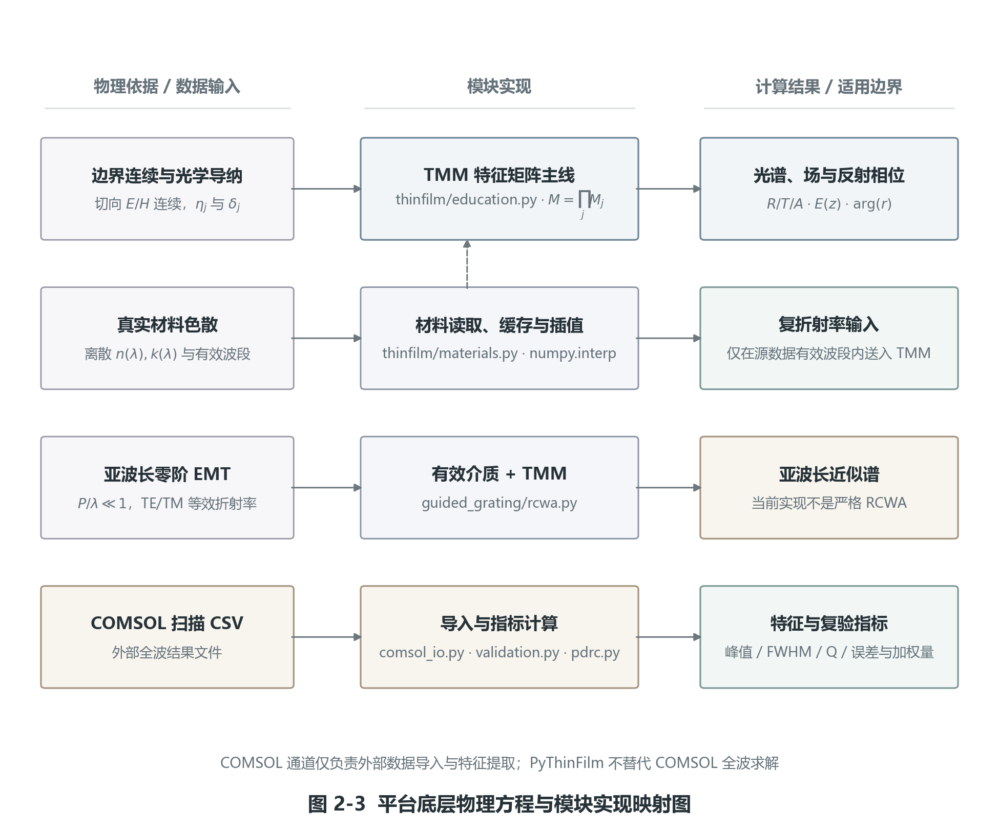
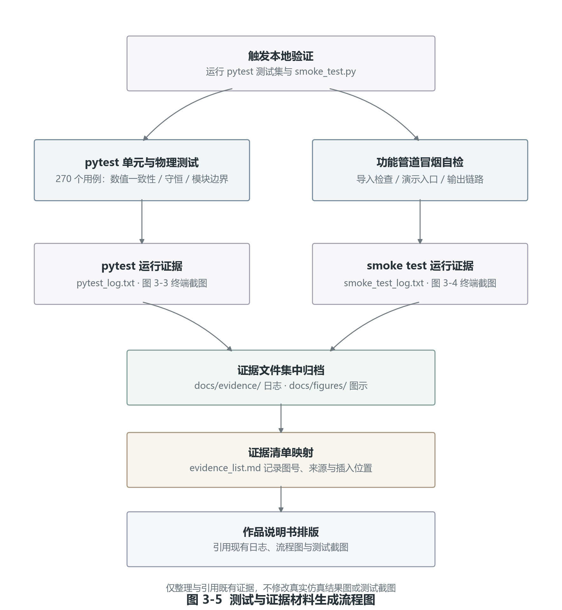

# PyThinFilm：基于 Python 的薄膜光学计算实验与教学平台

基于传输矩阵法（TMM）的平面多层膜光谱计算、真实材料 nk 数据导入、亚波长 EMT 零阶近似分析与教学复验平台。

---

## 一、项目定位

本项目旨在构建一个物理原理清晰、核心算法透明、易于拓展的平面多层膜电磁计算与教学复验平台。针对高校波动光学与电磁学教学中公式繁杂、物理图景抽象的痛点，平台通过 Python 将物理方程转化为直观的计算曲线与一维空间场强分布图。平台采用向量化计算设计，能够支持高流畅度的参数扫描，并且设计了与外部数值仿真软件及物理实验参考数据的比对分析接口，形成教学与科研的闭环链条。

---

## 二、系统总览与模块架构

本平台采用分层的模块化物理架构设计，主要业务模块的划分和复验链路关系如下图所示：



1. **运行入口**：`run_teaching_demo.py`、`run_case.py`、`run_material_library_demo.py`、`run_guided_grating_demo.py` 以及位于 `examples/` 和 `cases/` 下的独立运行脚本。
2. **计算核心**：
   - `thinfilm/education.py`：基于一维多层薄膜特征矩阵算法（TMM），利用 NumPy 向量化广播机制求解。
   - `thinfilm/materials.py`：管理实测光学常数数据库并提供线性插值与缓存机制。
   - `guided_grating/rcwa.py`：实现针对亚波长光栅的零阶极化等效介质近似（EMT）模型。
   - `guided_grating/comsol_io.py`：提供外部全波电磁散射仿真数据的读取与半高全宽（FWHM）、品质因子 $Q$ 等指标提取器。
3. **可视化渲染**：调用 Plotly 导出高清晰度交互式 HTML 页面及静态 PNG 图表。
4. **物理自检层**：包含由 270 个测试用例构成的 pytest 自动化测试套件与 `smoke_test.py` 自检脚本。

---

## 三、物理模型与技术边界

为防范科学计算与工程仿真中的表述风险，特声明本平台的底层物理计算模型与技术边界：

### 1. 核心计算模型 (TMM)
本平台的核心电磁场求解基于**传输矩阵法（TMM）**。通过在各平整介质界面施加麦克斯韦方程的切向连续电磁边界条件（$E_t$ 连续，$H_t$ 连续），构造 $2\times2$ 特征矩阵，并通过级联特征矩阵求解系统的总透射、反射与腔内一维电场驻波分布 $E(z)$。



### 2. 真实材料线性插值与复折射率符号约定
平台支持 Johnson-Christy 等实测物理常数 CSV 的加载，其数据处理逻辑如下：



- **线性插值**：调用 `numpy.interp` 将离散的实测 $n$ / $k$ 数据映射到目标仿真波长网格，默认禁止超出源数据范围的外推。
- **符号口径**：由 n(λ) 与 κ(λ) 构造复折射率 $\tilde{n}(\lambda) = n(\lambda) + ik(\lambda)$ 并输入 TMM 核心，其虚部用于描述介质的带间吸收与能流衰减，具体正负号取决于场的时间因子约定。
- **缓存机制**：使用单次读盘与内存字典缓存，避免由于重复进行磁盘读取导致的性能瓶颈。

### 3. 底层物理方程与模块映射
平台实现了底层电磁场公式在 Python 计算文件中的严格映射关系：



### 4. 明确的技术物理边界声明
- **关于 RCWA 求解器限制**：`guided_grating/rcwa.py` 文件名沿用了早期开发阶段的模块命名。当前 v0.2.1 版本中，该模块仅实现针对一维周期性亚波长光栅的**零阶极化等效介质近似（EMT）**，用于快速计算 TE/TM 偏振的零阶等效折射率，**不对应严格/完整的 RCWA（傅里叶空间特征值解算）算法，本身不承担周期光栅的高阶全波散射求解**。
- **关于外部数据比对**：`comsol_io.py` 仅作为外部 COMSOL 仿真结果（CSV 格式）的特征提取（FWHM、品质因子 $Q$ 等指标）与复验比对接口。**平台本身不是全波数值求解器，不提供且不替代 COMSOL 内部的网格离散与空间偏微分方程求解机制**。
- **关于软件状态声明**：平台定位为轻量级计算物理展示与教学工具。**仓库中不包含且不提供独立运行的 GUI 或 App 桌面客户端，亦不代表 App 已经完成。当前不依赖任何 GitHub Actions 持续集成自动化部署工具**。

---

## 四、快速开始

### 1. 环境准备
项目依赖 Python 3.8+ 及以下科学计算库。在终端中安装依赖：
```bash
pip install -r requirements.txt
```

### 2. 运行快速功能自检
运行一键自检脚本，自动测试基础计算模块、数据流解析以及结果输出路径的连通性：
```bash
python smoke_test.py
```

### 3. 运行教学主树案例
通过以下命令运行指定的经典物理实验，光谱结果、指标报告和交互式图表将自动导出至主目录的 `~/thinfilm_outputs/` 下：
```bash
python run_teaching_demo.py --case single_ar
```
若需查看所有可运行的经典教学案例列表，请输入：
```bash
python run_teaching_demo.py --list
```

---

## 五、经典教学案例

平台内置了针对物理光学经典现象的一维仿真复验：
1. **单层增透膜 (single_ar)**：展示在 1/4 波长条件和折射率匹配时，界面反射的相消干涉极小值。
2. **布拉格反射镜 (bragg_reflector)**：展示一维光子晶体随着交替介质周期数增加，光子带隙（高反射停带）强度的指数级增长。
3. **法布里-珀罗滤光片 (fp_filter)**：展示在双 DBR 微腔中间引入半波长缺陷层时激发的超窄带高透射共振峰。
4. **斜入射偏振各向异性 (metrics_bundle)**：斜入射角下 TE/TM 斜入射光学导纳分裂，复现 TM 波特有的布儒斯特角反射归零。

---

## 六、五个工程应用案例

位于 `examples/applications/`，专注于物理指标分析与光谱图表导出：
1. **太阳能电池减反膜** (`solar_cell_ar`)：针对 Si 衬底在 300–1100 nm 太阳光波段进行折射率匹配设计，最小化太阳光谱积分反射率。
2. **波分复用（WDM）三腔滤波器** (`wdm_filter`)：在 1540–1560 nm 频段级联多重微腔结构，实现平顶陡峭的带通物理响应。
3. **1064 nm 固体激光器反射镜** (`laser_mirror`)：为特定窄谱线激光源设计超高反射镜面，抑制膜系内部热吸收。
4. **相机镜头多层增透膜** (`phone_lens_ar`)：对比多层与单层减反膜在 400–700 nm 可见光宽带范围内的反射光谱抑制差异。
5. **智能窗户节能膜** (`smart_window`)：利用 TiO2/Ag/TiO2 夹心膜系对热红外波段（800 nm 以上）的高反射以及可见光波段的高透射，复现日光热量阻隔。

---

## 七、拓展研究示例

1. **被动辐射制冷 (PDRC)**：
   加载真实 $\text{SiO}_2$ 与 $\text{TiO}_2$ 色散数据，运行 `run_case.py --group pdrc --case cooling_bundle`。计算膜堆在 300–2500 nm 太阳光谱的积分反射率，以及在 8–13 μm 大气红外透明窗口的积分热辐射发射率，定量评估日间被动冷却特性。
2. **Tamm 界面局域态物理探讨**：
   运行 `run_case.py --group tamm --case interface_window_bundle`。求解 DBR 镜面与吸光层界面间的反射相位匹配极值条件，揭示一维表面受限状态的物理本征分布。

---

## 八、测试与自检证据链

为保障计算管线的可靠性与物理守恒律，平台设计了闭环的自动化验证证据链：



1. **物理一致性测试**：
   在 tests/ 目录下包含 **270 个单元用例**。强制断言验证了在斜入射、强吸收介质插值下反射率、透射率和吸收率之和恒等于 1.0 的物理守恒律 ($R + T + A \equiv 1.0$)，防止发生数值越界与物理退化：
   ```bash
   python -m pytest tests/ -v
   ```
2. **自检运行日志**：
   所有的测试日志和 smoke_test 功能流程证据链已集中归档在 `docs/evidence/` 目录中。

---

## 九、仓库结构

```text
PyThinFilm/
├── thinfilm/                    # 薄膜光学核心计算算法库
│   ├── api.py                   # 外部统一接口 API
│   ├── education.py             # 向量化 TMM 计算、电场驻波求解
│   ├── materials.py             # 真实介质折射率加载与线性插值
│   ├── validation.py            # 理论 vs 外部 CSV 误差分析
│   └── plotly_charts.py         # 交互式可视化 Plotly 渲染器
├── guided_grating/              # 光栅波导拓展研究支线
│   ├── rcwa.py                  # 亚波长周期光栅零阶极化等效介质近似 (EMT)
│   └── comsol_io.py             # 外部 COMSOL 扫描 CSV 解析与指标提取
├── cases/                       # Tamm/PDRC等专题及高级脚本运行文件夹
├── examples/                    # 经典教学及5个工程应用示范案例
├── tests/                       # 由 270 个测试用例构成的测试套件
├── docs/                        # 文档、流程图与测试日志存放目录
│   ├── figures/                 # 5 张流程图及案例输出图
│   └── evidence/                # 冒烟自检与 pytest 运行证据日志
└── requirements.txt             # 科学计算环境依赖包
```

---

## 十、版本状态与限制

- **当前版本**：v0.2.1 竞赛展示功能冻结版。
- **物理与计算局限**：
  - 核心求解器限于平面一维多层薄膜层叠结构（各向同性介质）。
  - EMT 模块在周期尺寸与波长可比拟（如 $P/\lambda \ge 0.5$）的共振发射区会因高阶衍射失效，计算时应严格评估物理近似边界。
  - 内存缓存为单进程生命周期，暂不支持外部持久化存储。
